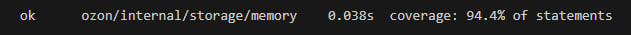
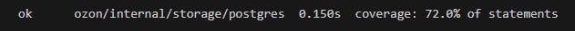
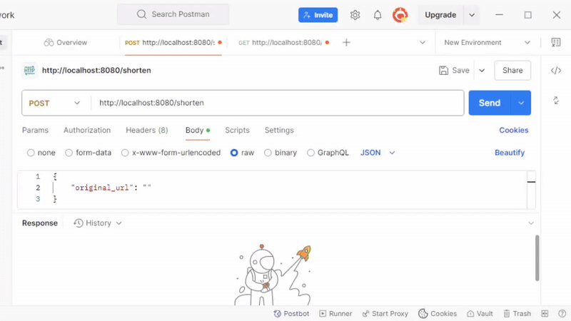

**🔗 URL Shortener Service**
URL Shortener Service – сервис для создания и управления короткими ссылками. Он позволяет пользователям генерировать уникальные сокращенные URL-адреса, хранить их в базе данных и получать оригинальные ссылки по сокращенным.

**Функциональность**
- Создание короткой ссылки: Пользователь вводит длинную ссылку и получает короткую, сгенерированную сервисом. Генерация криптографически безопасна, так как используется библиотека "crypto/rand".
- Получение оригинальной ссылки: По короткой ссылке можно получить оригинальный URL.
- Хранение данных в базе данных: Все ссылки сохраняются в PostgreSQL для обеспечения надежности и быстрого доступа.

**Стек технологий:**
- Go – основной язык программирования.
- PostgreSQL – реляционная база данных для хранения ссылок.
- Docker – контейнеризация для локальной разработки и деплоя.

**Покрытие тестами**






**Пример**


**Запуск проекта:**
Для локальной разработки и тестирования рекомендуется использовать Docker.  
```bash
git clone https://github.com/your-repo/Shortener_url.git
cd Shortener_url
docker-compose up --build
```  
Используемый порт: 8080

